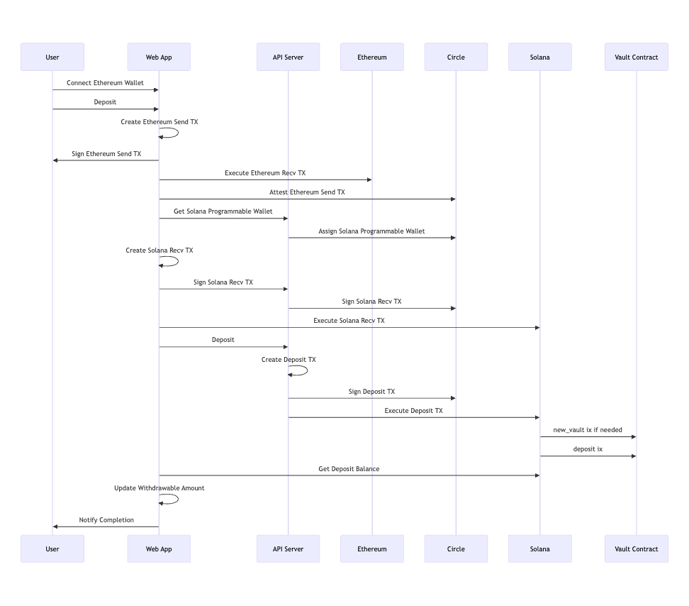
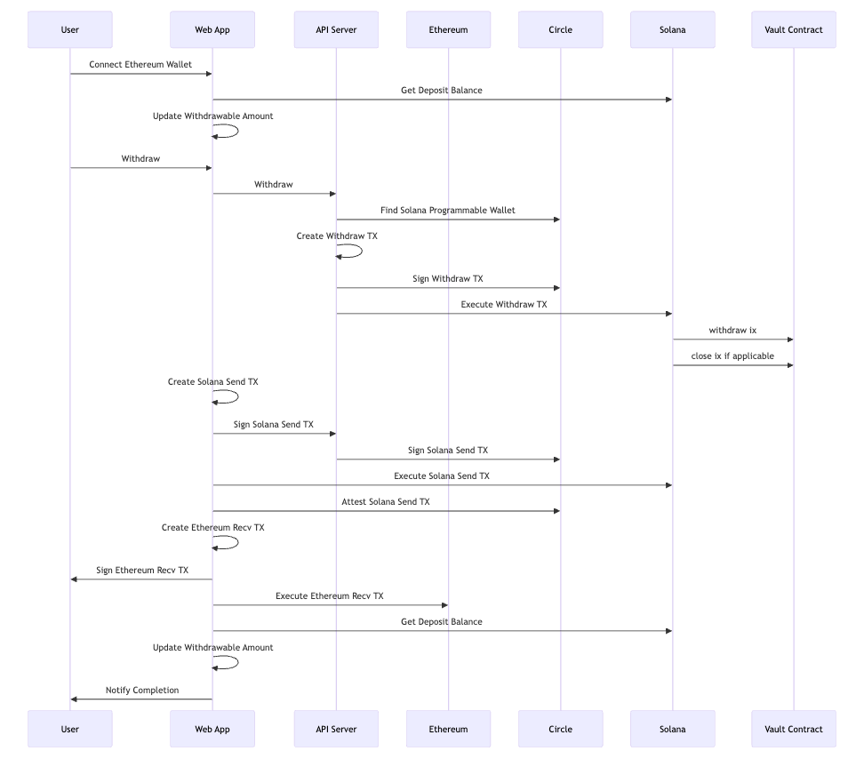

# Overview

We are participating in [Wormhole SIGMA Sprint](https://sigma.wormhole.com/sprint) with this project.

This project implements a mechanism to deposit USDC directly from chains like Ethereum to Windfall on Solana, using the Wormhole TS SDK and Circle CCTP USDC Transfer.

Please note that if bridging to Solana is available, tokens other than USDC can be supported, and thanks to Wormhole, a variety of source chains can also be supported for bridging, not limited to EVMs.

Here's how to use the frontend and understand the general flow of operations and inner workings:

- The end user connects to an EVM-compatible wallet *A* (we used Brave Wallet for testing)
- The backend creates a Circle Programmable Wallet *X* on Solana that is linked to wallet *A*
- When a user initiates a deposit operation:
  - Wallet *A* signs an EVM-side USDC transfer transaction to initiate a transfer
  - The system waits for Circle Attestation
  - Programmable Wallet *X* signs a Solana-side token receive transaction
  - Programmable Wallet *X* signs a Solana-side Windfall deposit transaction
- When a user initiates a withdrawal operation:
  - The end user connects their EVM-compatible wallet *A*
  - The backend looks up the Circle Programmable Wallet *X* on Solana that is linked to wallet *A*
  - Programmable Wallet *X* signs a Solana-side Windfall withdraw transaction
  - Programmable Wallet *X* signs a Solana-side USDC transfer transaction
  - The system waits for Circle Attestation
  - Wallet *A* signs an EVM-side USDC receive transaction

# Demonstration

The demo frontend is deployed at a temporary domain [https://test.softgate.co.jp/](https://test.softgate.co.jp/).


You can use this demonstration site to evaluate the project and see how it works.
Please refer to the demo video submitted for the hackathon for instructions on how to use this site.

The backend API server is deployed at [https://api.softgate.co.jp/sigma](https://api.softgate.co.jp/sigma).
The frontend mentioned above is configured to work with this backend API server.

These operate on the Ethereum Sepolia testnet and Solana devnet.
To perform actual bridge operations, you will need ETH and USDC on the Sepolia testnet.

To obtain testnet ETH and USDC, you can use the following faucet services (but not limited to them):

- [Alchemy Faucet](https://www.alchemy.com/faucets/ethereum-sepolia) (ETH)
- [Google Faucet](https://cloud.google.com/application/web3/faucet/ethereum/sepolia) (ETH)
- [Circle Faucet](https://faucet.circle.com/) (USDC)

Additionally, a compatible wallet must be installed in your browser and be set to interact with Ethereum Sepolia testnet.
Note that this application requires a wallet that can sign transactions without broadcasting them to the network.
During development, we used the Brave Wallet.
We have not verified functionality with other wallets, and MetaMask is *not* supported due to transaction signing limitation.

# Directory structure

The `frontend` directory contains all the source code for the web application intended for end users. If you want to try out this project yourself, this is the application you'll need to run.

The `api` directory contains the source code for the backend API server. Since the backend requires Circle Web3 Services API keys and other configurations, we recommend using the test server provided by Windfall.

The `program` directory contains the source code for a Solana program called `vault`.
While the `vault` program was copied from another repository and therefore doesn't have much commit history here, development of the `vault` program in the other repository began after the SIGMA Sprint period started.


# How to build

## Frontend

Create `frontend/.env` and specify settings like this:

```shell
NEXT_PUBLIC_ENABLE_TESTNETS = true
NEXT_PUBLIC_API_ENDPOINT = http://localhost:3010
```

`NEXT_PUBLIC_API_ENDPOINT` points to the HTTP API server described in the next section below.

To start the frontend, first navigate to the `frontend` directory and install the required packages:

```shell
npm install
```
Then run the local HTTP server with the following command:

```shell
npm run dev
```

After that, you can access the application by opening `http://localhost:3000` in your browser.

If you need testnet ETH and USDC, you can obtain them through the faucet services listed above.

## Backend (API Server)

Backend is an HTTP API server program that handles interactions with Circle Web3 Services and Windfall's `vault` program on Solana.

First, you need to sign up for Circle Web3 Services and obtain your API key, entity secret, and a wallet set.

Then create `api/.env.development.local` and provide your Circle API-related configurations:

```shell
CIRCLE_API_KEY = <YOUR_CIRCLE_TESTNET_API_KEY>
CIRCLE_ENTITY_SECRET = <YOUR_CIRCLE_ENTITY_SECRET>
CIRCLE_WALLET_SET_ID = <YOUR_CIRCLE_WALLET_SET_ID>
```

Edit `api/.env` to specify the port (otherwise defaults to 3000), blockchain (SOL or SOL-DEVNET), private key for a Solana account that temporarily covers transaction fees, and Solana RPC endpoint. These settings are for the HTTP API server and are not exposed externally.

```shell
PORT = 3010
BLOCKCHAIN = SOL-DEVNET
SOL_PAYER = [123,56,...,78,90]
RPC_ENDPOINT = <YOUR_RPC_ENDPOINT>
TOKEN_MINT = <DEPOSIT_TOKEN_MINT_PUBKEY>
VAULT_TYPE = <VAULT_TYPE_PUBKEY>
```

For devnet, you can use the following settings in `.env` and use the existing vault type which works with devnet USDC:

```shell
TOKEN_MINT = 4zMMC9srt5Ri5X14GAgXhaHii3GnPAEERYPJgZJDncDU
VAULT_TYPE = 2zHQowNu91LJrfaWfpNDMxFXr6DxNYXksYV24UbhBwRX
```

## Solana Program

```shell
anchor keys sync
anchor build
anchor test
```

As of this writing, the `vault` program is deployed on Solana devnet at `DcnDr4dPpXWHkmS8TSXG3bL9dnshCVRRzQi4gTndtUsG`.
It is recommended to use the deployed program as is in most cases.

# Sequence diagrams




